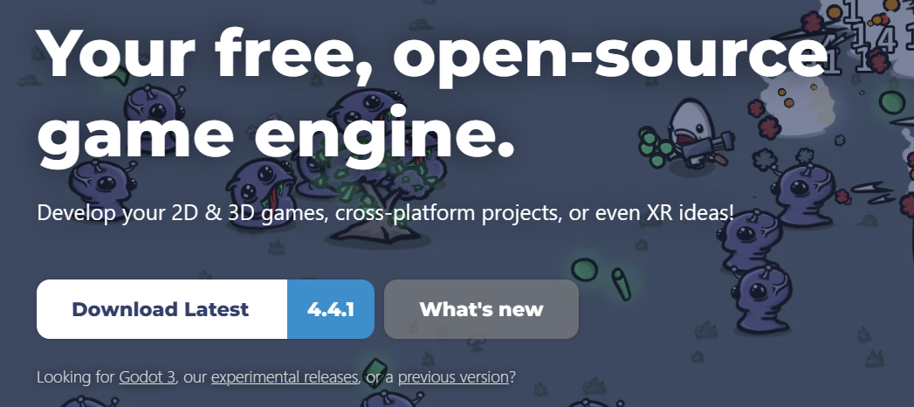
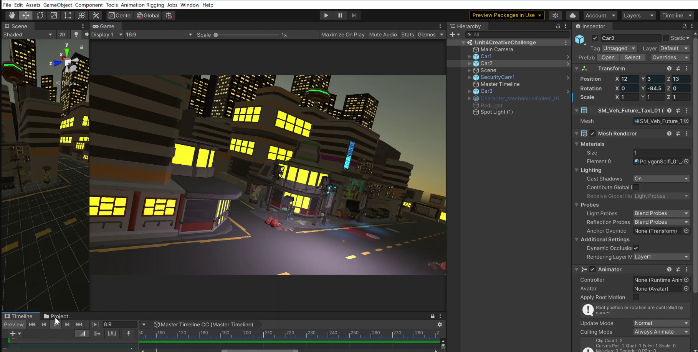
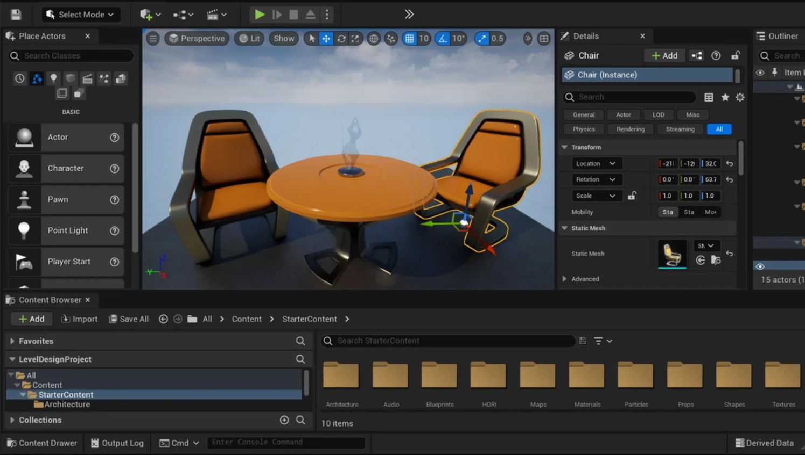

In this post, I compare Godot, Unity, and Unreal Engine across features, performance, and community support to help you choose the right engine for your next project.

## Features

### Godot

Godot’s node-based scene system and integrated GDScript make it incredibly approachable. You can also script in C#, C++, or VisualScript, and everything lives as files on disk—perfect for version control. Its MIT license means zero royalties or subscriptions.

### Unity

Unity supports both 2D and 3D out of the box, with a primary C# API and a massive Asset Store full of plugins, templates, and art assets. Three render pipelines (URP and HDRP) cover everything from mobile to high-end PC (However, I find it difficult to work around).

### Unreal

Unreal Engine (latest UE5) shines in photorealism thanks to Nanite (virtualized geometry) and Lumen (dynamic global illumination and reflections). Blueprint visual scripting complements its C++ core, giving you AAA-grade tools from day one, so no need to reinvent the wheel. I would like to try it out again later this year.

## Performance

- **Godot** excels in 2D, offering lightweight runtime assemblies and sub-millisecond frame times even on modest hardware. Its 3D capabilities have improved dramatically in 4.x but still lag behind the giants in extremely complex scenes.
- **Unity** performs well across platforms but can incur overhead in heavy HDRP scenes or when loading large asset bundles. Profiling and manual optimizations are often required for top-tier performance.
- **Unreal** delivers unrivalled fidelity and scale—Nanite can stream billions of triangles without hiccups, and Lumen brings real-time GI to life, provided you have a high-end GPU(but you need to know the basic of baking or you will sacrifice the performance a lot on the user).

## Community & Ecosystem

- **Godot** has a passionate open-source community, with rapid iteration on features and a growing plugin repository, though its third-party asset library remains smaller, but ive seen it growing that unity assets start supporting godot and unreal.
- **Unity** boasts the largest developer base, extensive documentation, tutorials, and an Asset Store that can save weeks of work—at the expense of subscription fees for larger teams. However, Unity 6 has been criticized for its lack of innovation in recent years, with many developers feeling it has stagnated compared to Godot and Unreal. There is recent CTO shuffle which has left many in the community wondering about the future direction of Unity.
- **Unreal** offers a robust Marketplace and deep integration with Quixel Megascans. Documentation and sample projects are extensive, but the engine’s complexity can intimidate beginners. Its been use in film and AAA games for years, so you can find a wealth of resources, it feels like a factory with everything you need to build a game, but it can be overwhelming for new users.

## When to Choose Which

- **Godot as your Swiss Army knife**: Need rapid prototyping, 2D games, or tooling? Godot lets you move fast without licensing headaches.  
- **Unity 6 is lacking**: Despite broad support and a mature pipeline, Unity 6 still hasn’t closed the gap on Godot’s 2D workflow or matched Unreal’s plug-and-play AAA features, making it feel less compelling as a true all-rounder.
- **Unreal for indie AAA polish**: Small teams chasing console-quality visuals, advanced physics, or large-scale worlds will find Unreal’s toolset unrivalled—if they can handle the learning curve and hardware demands.  

## Conclusion

Each engine has its sweet spot. **Godot** offers speed, flexibility, and zero cost—ideal for indies and rapid prototyping. **Unity** remains a solid generalist with vast community resources but faces growing competition. **Unreal** stands alone for cutting-edge visuals and scale, making it the go-to for indies who want AAA without building a custom engine.

Personally i picked **Godot** for my next project because it aligns with my need for rapid iteration, lightweight, and ease of use, especially in 2D. However, I’m excited to explore **Unreal** for future projects that demand high-end graphics and complex interactions.
