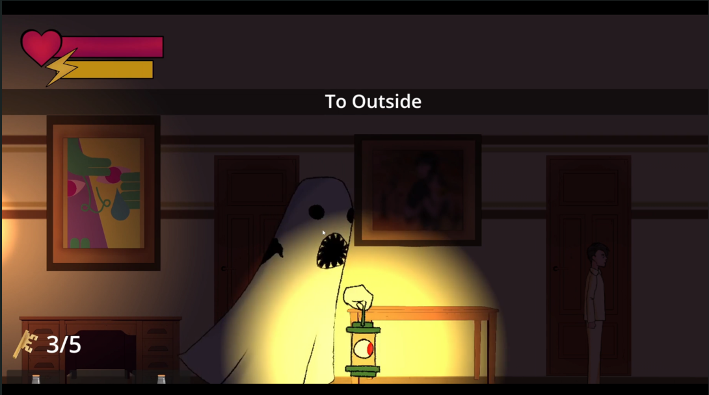

## Overview

In this post, I've developed a 2D horror game and a 3D horror game with my colleagues, and I want to share my experiences with both. I'll discuss the unique challenges and advantages we encountered during development, as well as how each approach impacted player engagement and immersion.

## Whats the Difference?

THE MATH behind 2D and 3D games is fundamentally different. In a 2D game, the world is flat, and all interactions occur on a single plane(x and y). This simplicity allows for easier asset creation and faster development cycles. However, it can limit the depth of immersion and spatial interaction. Howevery you could use parallax scrolling to create a sense of depth, but it still lacks the full 3D experience. So it's just depth illusion.

In contrast, 3D games operate in a three-dimensional space (x, y, and z), allowing for more complex interactions and a greater sense of immersion. The math behind 3D games involves transformations, projections, and lighting calculations, which can be more challenging to implement but result in a richer player experience.

## Development Challenges

### 2D Horror Game

The 2D horror game we developed had its own set of challenges. Creating a compelling atmosphere with limited visual depth required us to focus heavily on art style, sound design, and narrative. We used 2D lighting techniques to evoke a sense of nostalgia while incorporating eerie soundscapes to enhance the horror elements.

### 3D Horror Game

The 3D horror game presented a different set of challenges. The complexity of 3D modeling, animation, and physics required a more robust development pipeline. We had to consider camera angles, lighting effects, and spatial audio to create an immersive environment. The increased detail in graphics allowed for more realistic scares, but it also demanded more resources and time.

## Whats the similarities?

Both 2D and 3D horror games share common elements that contribute to the horror experience. These include:

- **Atmosphere**: Both types of games rely on creating a tense and unsettling atmosphere through visuals, sound, and narrative.
- **Storytelling**: Engaging narratives are crucial in both formats to keep players invested and heighten the horror experience. Like why the player is in this situation, and what is the backstory of the horror.
- **Gameplay Mechanics**: Core gameplay mechanics, such as exploration, puzzle-solving, and survival elements, can be found in both 2D and 3D horror games. These mechanics are essential for player engagement and immersion. however, the implementation may differ due to the dimensionality of the game.
- **Pacing**: Effective pacing is essential in both formats to build tension and deliver scares at the right moments. Since you don't want to overwhelm the player with too many scares at once, or too little jumpscare, you need to balance the pacing of the game.
- **Environmental Storytelling**: Both formats can use the environment to tell a story, revealing lore and backstory through visual elements and interactions. This in my opinion is the most important part of a horror game, because it can make the player feel like they are in a real world, and the horror is happening in that world.
