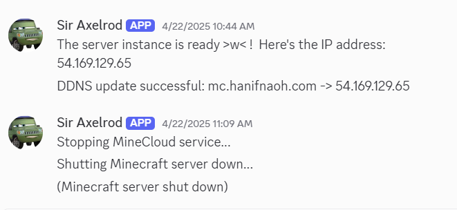

## Overview

In this post, I walk through deploying a Minecraft server using AWS services and creating a Discord bot to manage the server, including commands for user management and notifications.



## What Stack I Use

- **Infrastructure as Code**: AWS CDK (TypeScript) this is the best practice for managing AWS resources(Totaly recommend it😎)
- **Compute**: EC2 Spot Instances (t3.large spot for the server 8GB Ram since its modded)  
- **Storage**:  
  - S3 for automated world backups  
  - EFS for persistent storage of the Minecraft server data
- **Networking**:  
  - VPC with public and private subnets  
  - Security Groups for access control  
  - Cloudflare for rerouting traffic to my domain  
- **Serverless Glue**: AWS Lambda for the Discord bot backend
- **CI/CD**: GitHub Actions to synthesize and deploy CDK stacks, package and deploy the bot

## Discord Bot Feature

The Discord bot (built in Node.js with discord.js) lives in Lambda and offers slash commands for administrators:

- `/mc_start` – Spins up the Spot instance and registers it behind the load balancer  
- `/mc_stop` – Drains connections, gracefully shuts down the server, and scales the fleet back to zero  
- `/mc_restart` – Executes a stop, waits for cool-down, then starts fresh  
- `/mc_backup` – Triggers an immediate S3 snapshot of the world directory  
- `/mc_backup_download` – Posts a pre-signed S3 link so admins can grab the latest backup  
- Automatic idle-shutdown notifications in a designated “ops” channel when no players have joined for 15 minutes

yes i use the light mode
